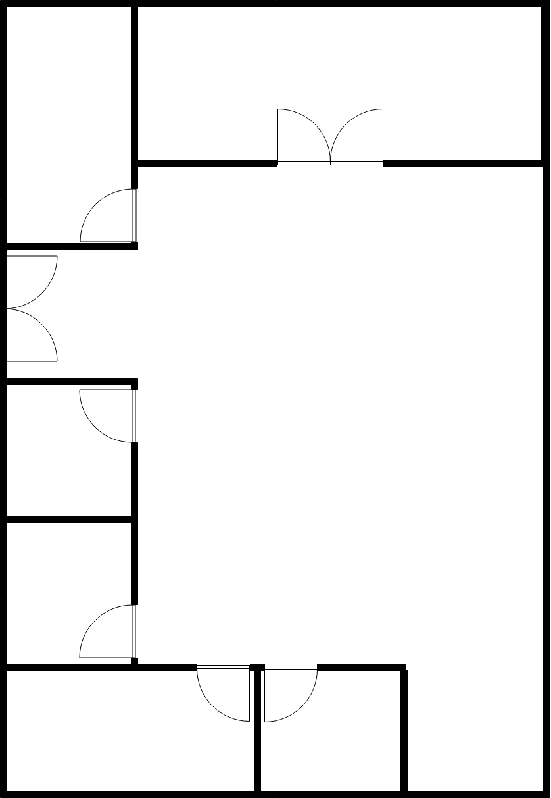

# Testing plan

## Phase 1 - Museum localization (alone)

The point for the moment is just to test if localization works in general with the museum layout, not taking into account missing anchors or network sharing.

1. Using tape, set up a scale floor plan of the Chambord Castle in the Atrium
2. Place anchors in some of the "rooms"
3. Set up video tracking system to get ground truth
4. Do some walks
5. Compare measured positions with ground truth

## Phase 2 - Hidden Line of Sight (alone)

This is to measure position accuracy when not enough anchors are available for trilateration.

1. Place anchors in hallways
2. Walk along pre-established paths (no video system required for ground truth)
3. Compare measured positions with ground truth

## Phase 3 - Hidden Line of Sight (collaborative)

This is to verify if network sharing works and provides reasonable positioning information.

1. Place anchors in hallways
2. Place audio guides in hallways (first iteration: static, second iteration: moving)
3. Walk along pre-established paths (no video system required for ground truth)
4. Compare measured positions with ground truth

## Phase 4 - Museum localization (collaborative)

This is to verify if multiple devices (up to 10) can share the network correctly and maintain accurate positioning within the museum's layout.

1. Using tape, set up a scale floor plan of the Chambord Castle in the Atrium
2. Place anchors in some of the "rooms"
3. Set up video tracking system to get ground truth
4. Place audio guides in some rooms (first iteration: static, second iteration: moving)
5. Do some walks
6. Compare measured positions with ground truth

## This is the floorplan that wil be used for phases 1 and 4

